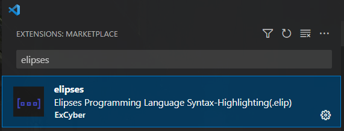
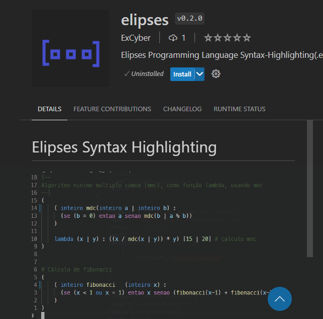

# Elipses Syntax Highlighting

Syntax Highlignting for Elipses Programming Language, using Tex Grammar which is a regex tokenization.

- Example on a dark theme

- Example on another light theme

# Search:

 

# Install:

## Also available at:
``https://marketplace.visualstudio.com/manage/publishers/ExCyber/extensions/elipses/hub``
